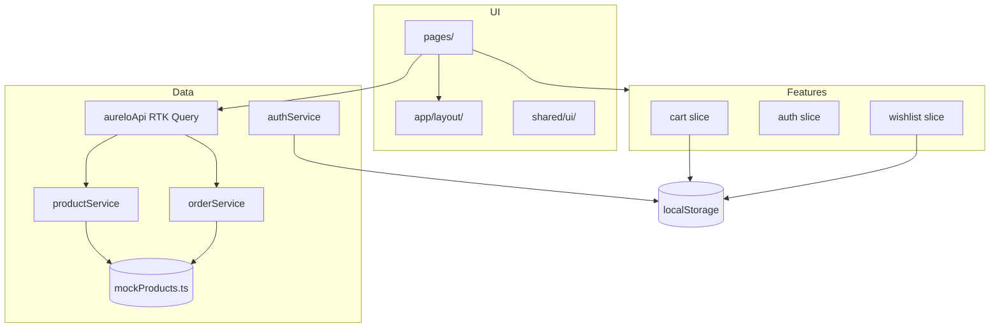

# Aurelo — Premium Custom Apparel

A production-grade portfolio storefront for bespoke streetwear: editorial luxury UI, full demo mode (no paid backend), and a clean path to Firebase or a Node API later.


## Live demo

> Deploy to Vercel and add your URL here: `https://your-app.vercel.app`

## Quick start

```bash
npm install
npm run dev
```

Open [http://localhost:5173](http://localhost:5173).

```bash
npm run build    # production build
npm run test     # Vitest + RTL
npm run lint     # ESLint
npm run format   # Prettier
```

## Demo credentials

| Role     | Email              | Password  |
|----------|--------------------|-----------|
| Customer | any@email.com      | any       |
| Admin    | admin@aurelo.pk    | admin123  |

First login seeds sample orders (pending, active, delivered) for portfolio showcase.

## Environment

Copy `.env.example` to `.env`:

| Variable            | Values              | Description                          |
|---------------------|---------------------|--------------------------------------|
| `VITE_DATA_SOURCE`  | `mock` \| `firebase` \| `api` | Product/order data backend   |
| `VITE_AUTH_MODE`    | `demo` \| `firebase`        | Authentication mode          |
| `VITE_API_BASE_URL` | URL                 | When `VITE_DATA_SOURCE=api`          |

## Tech stack

- React 19 + Vite 8 + TypeScript (strict)
- Redux Toolkit + RTK Query (server state)
- React Router 7 (lazy routes)
- Tailwind CSS v4 + design tokens
- react-hook-form + Zod
- Sonner (toasts)
- Framer Motion (animations, respects `prefers-reduced-motion`)
- Vitest + React Testing Library

## Architecture



### Folder structure

```
src/
├── app/           # store, router, api, layout
├── features/      # cart, auth, catalog, checkout, orders, wishlist, admin
├── pages/         # route-level screens
├── services/      # productService, orderService, authService
├── data/          # mock catalog (46 products)
├── shared/        # ui, hooks, types, animations, icons
└── test/          # Vitest setup + smoke tests
```

## Features

- **Shop** — category, audience, price, sort, debounced search, load more
- **Product detail** — gallery, size guide modal, reviews, related products
- **Cart** — Redux + localStorage, normalized line keys (`productId::size`)
- **Checkout** — 3-step flow, Zod validation, JazzCash / EasyPaisa / bank
- **Auth** — demo mode + Firebase-ready service layer
- **Account & orders** — tabs, timeline, cancel pending orders
- **Wishlist** — persisted locally
- **Admin** — product table, order status updates (demo)
- **404 / 500** — styled error pages

## Deploy (Vercel)

`vercel.json` includes SPA rewrites. Set env vars in the Vercel dashboard to match `.env.example`.

## License

MIT — portfolio use.
